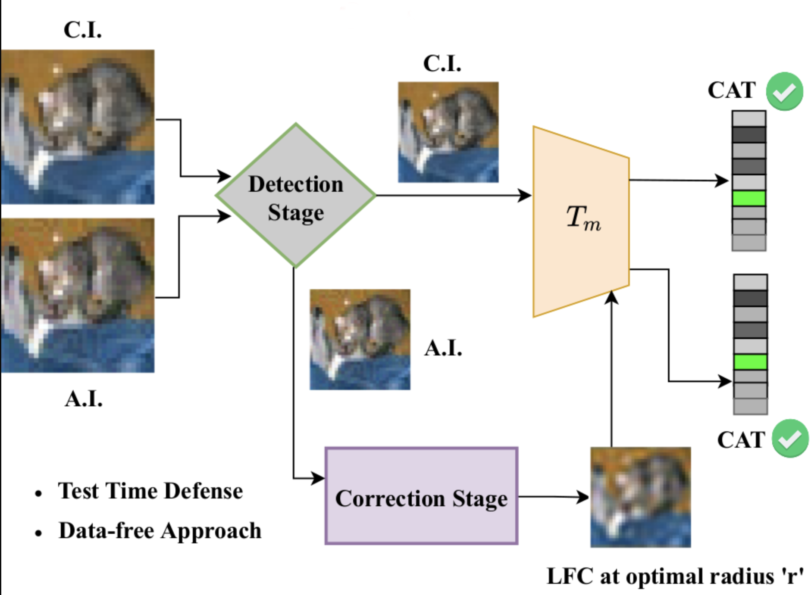

# DAD: Data-free Adversarial Defense at Test Time (WACV 2022) - Official Implementation

Paper link: https://openaccess.thecvf.com/content/WACV2022/papers/Nayak_DAD_Data-Free_Adversarial_Defense_at_Test_Time_WACV_2022_paper.pdf

Poster: https://drive.google.com/file/d/16VvThgTOMY28dMTlk4-NA9O9WQMyWLEc/view

Project webpage: https://sites.google.com/view/dad-wacv22

<hr>

### Method Overview


<hr>

### Dependencies
- tqdm
- torch
- numpy
- torchattacks

<hr>


### Evaluating Combined Performance (Correction + Detection):
``` ./scripts/combined.sh```

<hr>

### Citation:
If you use this code, please cite our work as:
```bibtex
    @inproceedings{
        nayak2021_DAD,
        title={DAD: Data-free Adversarial Defense at Test Time},
        author={Nayak, G. K., Rawal, R., and Chakraborty, A.},
        booktitle={IEEE Winter Conference on Applications of 
        Computer Vision},
        year={2022}
    }
```
<hr>

### Acknowledgements

This repo borrows code from [Do We Really Need to Access the Source Data? Source Hypothesis Transfer for Unsupervised Domain Adaptation](https://github.com/tim-learn/SHOT) and [High Frequency Component Helps Explain the Generalization of Convolutional Neural Networks](https://github.com/HaohanWang/HFC)